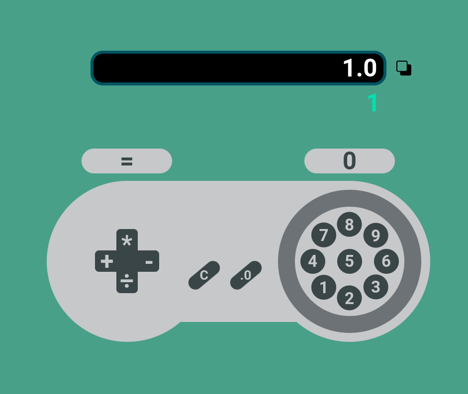

<h1 align="center"> SNES Calculator </h1>

Uma calculadora simples com o design de um controle SNES

<h3 align="center"><a href="https://jairo-sousa.github.io/snes-calculator/" >Clique para visitar o projeto</a></h3>

## Objetivo

Praticar as tecnologias usadas

## Tecnologias

Projeto desenvolvido com as seguintes tecnologias:

- HTML e CSS
- JavaScript
- Git e Github

## Layout

Você pode visualizar o layout do projeto através [DESSE LINK](https://www.figma.com/community/file/1189642554932733397). É necessário ter conta no [FIGMA](https://www.figma.com/) para editá-lo.

---

Feito por <a href="https://github.com/jairo-sousa/" target="_blank">Jairo Sousa</a>
